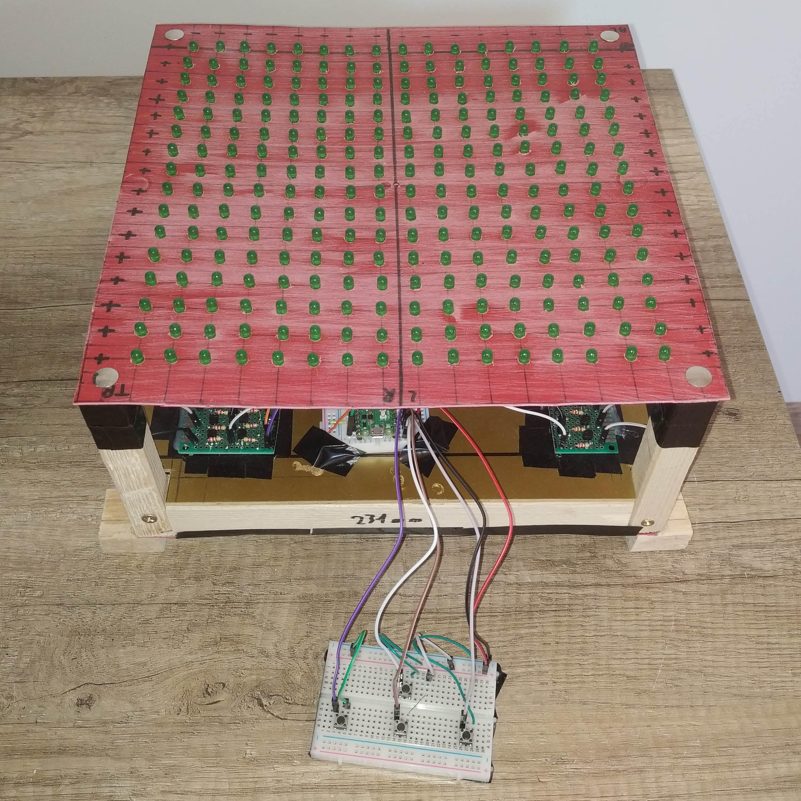

## Please forgive my lack of photographing, video-taping and editing skills :sweat_smile:.

## Links to YouTube videos (+/- 30sec) that show the parts of the project:
- [main menu](https://youtu.be/FYprERUIYYM)
- [animations](https://youtu.be/SWTPR11ht4Y)
- [snake](https://youtu.be/PKFoMC5XBok)
- [pong](https://youtu.be/_4tUVSYrDKQ)

## Note:
You can see on the videos that the matrix is "pulsating" right? Each "pulse" is a singular frame, meaning: each pulse the the process of lighting up each of the 16 rows of LEDs, from top to bottom, that's why the pulse travels in that direction (top to bottom)

## Pictures
### The matrix

### Input device / "gamepad"

